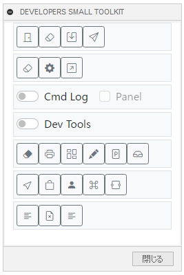

# Fusion360 Developers Small ToolKit

これは、オートデスクソフトウェア「Fusion360」のアドインです。

通常のユーザーには、ほぼ無意味なFusion360 API 開発者向けの小さな工具箱です。

---

## インストール :

インストールする際は、zip ファイルをダウンロード/展開後 "Developers_Small_ToolKit" フォルダをアドインとして登録してください。

アドインの登録は、[こちら](https://kantoku.hatenablog.com/entry/2021/02/15/161734)の手順に従ってください。

**Ver0.1.0以前をインストールしている場合は、完全に削除してください。**

## 使用法 :

アドイン起動後は、画面右にドッキングして表示されます。又、"ツール" - "アドイン" 内に "Developers Small ToolKit" コマンドが追加されるため
クリックする事でモーダレスダイアログが表示されます。
モーダレスの為、ダイアログを表示したままでも通常も作業が行えます。

アドイン起動時には Fusion360 と内部で使用されている Python のバージョンを出力します。

各コマンド出力される結果については、ほぼ全てテキストコマンドウィンドウに表示されます。

---
- Close all docs: 開かれているドキュメントで変更の無いものは先に閉じ、残り全て**保存せず**閉じます。
- Remove Custom Graphics: 全てのカスタムグラフィックスを削除します。
- Export TextCommands List: TextCommands(txt)のコマンドリストをファイルに保存します。
- Create Language Startup Fusion360 Script: 日本語・英語を指定して起動するためのスクリプトファイルを作成します。
---
- Open CustomPost Folder: カスタムされた製造ポストファイル(cps)のフォルダーを開きます。
- Open InstallPost Folder: インストールされた製造ポストファイル(cps)のフォルダーを開きます。
- Open Post Library WebSite: Post Library のウェブサイトをブラウザで開きます。
---
- Cmd Log: 実行されたコマンド名とコマンド ID を出力します。

  - Panel: コマンドのログと共にパネル情報を出力します。~~が、現在は正しくない情報を出力する可能性もあります。~~
---
- Dev Tools: パネル用デベロップツール
---
- Window Clear: 出力先をクリアします。
- Dump CommandDialog Info: 表示されているコマンドダイアログ情報を出力します。
- Dump Entity Paths: 選択されているエンティティ ID を出力します。(テキストコマンド用)
- Dump Entity Props: 選択されているエンティティのプロパティを出力します。(テキストコマンド用)
- Dump OKN: 選択されているエンティティのOKNを出力します。(テキストコマンド用)
---
- Open Install Folder: 起動中のバージョンのFusion360のインストールフォルダを開きます。
- Open Cache Folder: ローカルキャッシュフォルダーを開きます。
- Open User Directory: ユーザーディレクトリーを開きます。
  - 'JSLoadedScriptsinfo'　が、登録されたスクリプト/アドイン管理ファイルです。
- Open Active Command Resource Folder: 実行中のコマンドダイアログのリソースフォルダを開きます。
- Open Commands Folder: コマンドを追加するためのフォルダーを開きます。
---
- Dump Document Attributes: アクティブなドキュメントの属性情報をダンプします。
- Remove Document Attributes: アクティブなドキュメントの属性情報を全て削除します。
- Remove UserParameter Attributes: ユーザーパラメータの属性情報をダンプします。

## 注意 ：

- 未完成の為、今後も変更されます。
- テキストコマンドを多数使用している為、将来的に機能しなくなるものも有ると思われます。

## アクション :

以下の環境で確認しています。

- Fusion360 Ver2.0.14109
- Windows10 64bit Pro , Home

## ライセンス :

MIT

## 謝辞 :

- [日本語フォーラム](https://forums.autodesk.com/t5/fusion-360-ri-ben-yu/bd-p/707)の皆さん、ありがとう。
